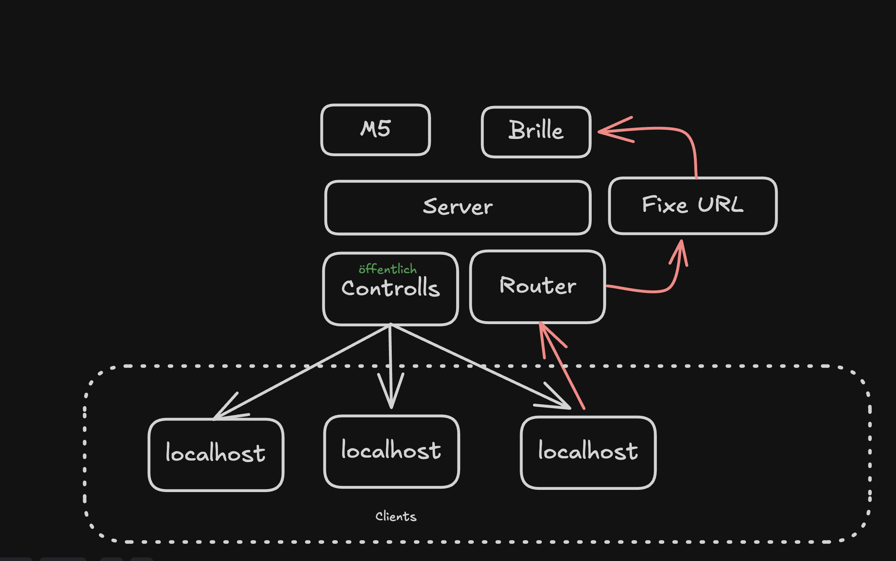

# Icaros Host ✈️

Icaros Host ist der Stationsserver für VR Experiences.

Der Host ist nicht die Experience. Er verbindet M5-Controller, Operator-Konsole
und externe WebXR/VR-Clients. Die Brille kennt eine feste Host-URL. Der Host
entscheidet, welcher registrierte lokale Client gestartet wird, und stellt allen
Experience Clients einen kleinen normierten Control-Stream bereit.

Die wichtigsten Aufgaben sind:

- Runtime Clients für die Launch-Auswahl registrieren
- den konkreten Launch-Client auswählen
- `/launch` auf die HTTPS-URL dieses Clients weiterleiten
- Controller-Daten vom M5 empfangen
- Rohdaten bereinigen, normalisieren, glätten und absichern
- sichere Controller-Daten als öffentlichen normierten Stream bereitstellen
- HTTPS/WSS für Quest- und Browser-Clients erzwingen

## Architektur 🧭



Das Kernmodell ist bewusst klein:

1. Der M5 sendet Rohdaten nur an den Host.
2. Lokale Browser- oder WebXR-Clients laufen separat und können sich beim Host
   registrieren.
3. Die Operator-Konsole wählt einen konkreten online Runtime Client aus.
4. Die Brille öffnet immer dieselbe Host-URL: `/launch`.
5. Der Host leitet `/launch` per `307` auf die registrierte HTTPS-URL des
   ausgewählten Clients weiter.
6. Controller-Daten laufen davon getrennt über `/ws/control/main` zu den
   Experience Clients.

Der Host streamt keine Website über WebSocket und startet keine Experience
selbst. Experiences rendern ihre eigene WebXR-Welt und lesen nur den
öffentlichen Control-Stream.

```txt
M5-Rohdaten -> Host -> control.orientation -> Experience
```

Der öffentliche Control-Payload ist klein und stabil:

```ts
type ControlOrientation = Readonly<{
	pitch: number;
	roll: number;
	quality: number;
	controllerType: 'm5';
}>;
```

`pitch` und `roll` liegen im Bereich `-1..1`. `quality` liegt im Bereich
`0..1`. Wenn der Controller fehlt, veraltet ist oder unsichere Werte liefert,
sendet der Host neutrale Werte mit `pitch: 0`, `roll: 0` und `quality: 0`.

## Client-Endpunkte

| Endpunkt | Protokoll | Client | Zweck |
| --- | --- | --- | --- |
| `/` | HTTPS | Operator Browser | Technische Konsole, Launch-Auswahl, M5-Setup |
| `/launch` | HTTPS | Quest/PICO Browser | Feste Brillen-URL; leitet per `307` zum ausgewählten HTTPS-Client weiter |
| `/ws/control/main` | WSS | VR Experience Clients | Öffentlicher normierter Control-Stream |
| `/ws/runtime` | WSS | VR Experience Clients | Launch-Registration, Client-Status und Präsenz |
| `/ws/device` | WS | M5 Controller | Firmware-kompatibler Gerätesocket für rohe Controller-Frames |
| `/health` | HTTPS | CLI, Monitoring | Einfache Erreichbarkeitsprüfung |
| `/api/m5-pairing` | HTTPS JSON | CLI, Automation | Diagnose- und Pairing-Adapter für M5-Setup |

Experience Clients verwenden `/ws/control/main` für Steuerdaten. Sie verwenden
`/ws/runtime`, wenn sie in der Launch-Auswahl erscheinen sollen. Sie verbinden
sich nicht direkt mit dem M5 und lesen keine Rohdaten.

### Nachrichten für Experience Clients

Auf `/ws/runtime` senden registrierte Launch Clients:

- `client.hello`
- `client.heartbeat`

Auf `/ws/runtime` empfangen sie:

- `client.registered`
- `client.rejected`
- `station.state`
- `runtime.clients` für Präsenz- und Operator-State; normale Experiences dürfen
  diese Nachricht ignorieren

Auf `/ws/control/main` empfangen Control-Stream-Abonnenten:

- `control.orientation`

Der vollständige Wire Contract steht in
[docs/client-api.md](docs/client-api.md).

## Installation

Voraussetzung: Bun ist installiert.

```sh
bun install
```

Der Host braucht lokale TLS-Dateien:

```txt
.certs/icaros-host.pem
.certs/icaros-host-key.pem
```

Die Einrichtung ist in
[docs/quest-https-launch-routing.md](docs/quest-https-launch-routing.md)
beschrieben. Host und VR Client besitzen jeweils eigene Zertifikate.

## Server Starten

Normaler Start für Entwicklung und Betrieb:

```sh
bun run build
bun start
```

`bun run build` erzeugt das SvelteKit-Produktionsartefakt. `bun start` startet
dieses Artefakt, prüft TLS und gibt die erreichbaren URLs aus. Es baut nicht
erneut und weicht nicht still auf Ersatzports aus.

```txt
https://localhost:5183/
https://<host-lan-ip-or-name>:5183/
ws://<host-lan-ip-or-name>:5184/ws/device
```

Für feste Stations-Setups bleibt der Alias:

```sh
bun run start:strict
```

`start:strict` nutzt denselben festen Startpfad. Explizit gesetzte Ports wie
`PORT` oder `ICAROS_DEVICE_WS_PORT` sind ein Vertrag und werden nicht still
geändert.

Der Host darf ohne konfigurierten Controller starten. M5-Pairing,
Firmware-Updates, Diagnose und Controller-Setup laufen danach über die Konsole
oder die CLI, nicht als Teil von `bun start`.

Der Prozess bleibt im Terminal aktiv. Stoppen mit `Ctrl-C`.

Für reine UI-Arbeit ohne Hardware:

```sh
bun run dev:ui-only
```

`dev:ui-only` ist nur für lokale Svelte-UI-Inspektion gedacht. Es ersetzt nicht
den HTTPS/WSS-Host-Start für Quest, Runtime Clients oder M5-Geräte.

## Nutzung

1. Host starten.
2. Operator-Konsole im Browser öffnen:

   ```txt
   https://<host-lan-ip-or-name>:5183/
   ```

   Für reine lokale Desktop-Checks kann `https://localhost:5183/` reichen. Für
   Quest/LAN-Sessions sollte die Konsole während eines Laufs über eine stabile
   LAN-Origin geöffnet bleiben, damit SvelteKit Form Actions und `/launch`
   dieselbe Origin verwenden.

3. M5-Controller über die Konsole oder CLI einrichten.
4. Einen VR Experience Client separat über HTTPS starten.
5. Der Client verbindet sich mit `/ws/control/main` und sendet optional
   `client.hello` an `/ws/runtime`.
6. In der Operator-Konsole den konkreten Runtime Client auswählen.
7. Quest/PICO öffnet die feste Host-URL:

   ```txt
   https://<host-lan-ip-or-name>:5183/launch
   ```

8. Der Host leitet auf die HTTPS-URL des ausgewählten Clients weiter.

Wenn kein Client ausgewählt ist, der Client stale ist oder seine registrierte
URL kein HTTPS nutzt, scheitert `/launch` klar statt auf einen Default
zurückzufallen.

## Neue Clients Einrichten

Ein neuer VR Client ist ein eigenständiges WebXR-Projekt. Er muss:

- über HTTPS laufen
- den Host über `wss://<host-origin>/ws/control/main` für Steuerdaten erreichen
- optional `client.hello` und danach `client.heartbeat` an `/ws/runtime` senden
- im `client.hello` eine konkrete HTTPS-URL für `/launch` registrieren
- nur die öffentlichen `control.orientation`-Werte für die Steuerung verwenden
- neutrale `pitch`/`roll`-Werte direkt anwenden und `quality` als Signalqualität behandeln
- eigene TLS-Zertifikate verwenden

Als Referenz für Client-Projekte dienen:

- [Icaros VR Client](https://github.com/dweigend/Icaros_VR_Client)
- [Neural Flight Template](https://github.com/dweigend/neural-flight-template)
- [Neural Flight](https://github.com/dweigend/neural-flight)

## Diagnose

M5- und Host-Diagnosen laufen über die CLI:

```sh
bun run m5:pairing -- health
bun run m5:pairing -- protocols
bun run m5:pairing -- snapshot
bun run m5:pairing -- checklist
```

USB- und Firmware-Funktionen:

```sh
bun run m5:pairing -- probe
bun run m5:pairing -- flash
bun run m5:pairing -- pair
bun run m5:pairing -- abort
```

Runtime-Smoke-Test bei laufendem Host:

```sh
bun run smoke:runtime
```

## Dokumentation

| Dokument | Inhalt |
| --- | --- |
| [docs/host-lifecycle.md](docs/host-lifecycle.md) | Kurze Code-Tour durch Start, Gateway, Launch, M5 und Diagnose |
| [docs/architecture.md](docs/architecture.md) | Architekturgrenzen und Ownership |
| [docs/client-api.md](docs/client-api.md) | Schnittstelle für VR Experience Clients |
| [docs/client-prompt.md](docs/client-prompt.md) | Checkliste und Prompt für neue Clients |
| [docs/quest-https-launch-routing.md](docs/quest-https-launch-routing.md) | HTTPS, Quest/PICO Launch, Zertifikate und Troubleshooting |
| [docs/debugging.md](docs/debugging.md) | Debugging und Diagnose |
| [AGENTS.md](AGENTS.md) | Arbeitsregeln für Coding Agents |

## Checks

```sh
bun run check
bun run lint
bun run test
bun run build
```

## Hardware

- [M5Stack StickC Plus](https://shop.m5stack.com/products/m5stickc-plus-esp32-pico-mini-iot-development-kit)
- [Meta Quest 3](https://www.meta.com/de/quest/quest-3/)
- [PICO 4 Ultra Enterprise](https://www.picoxr.com/de/products/pico4-ultra-enterprise)
