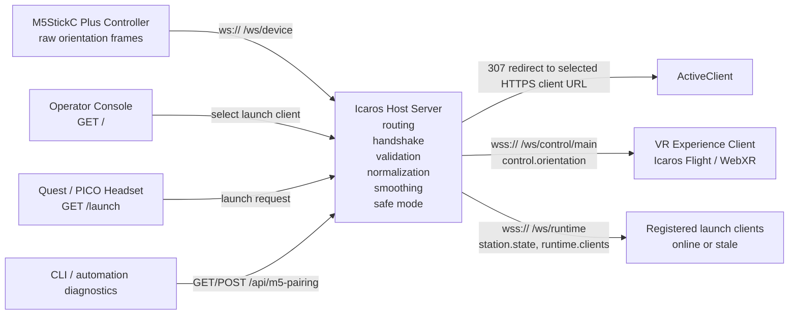

# Icaros Host ✈️

Dies ist ein Host-Server für VR Experiences.

Der Server wurde insbesondere für die Icaros Flight Installation entwickelt. Er
verbindet den M5-Controller, die Operator-Konsole und externe WebXR/VR-Clients.
Die wichtigsten Aufgaben sind:

- Experiences für Launch-Auswahl registrieren
- den Launch-Client auswählen
- Controller-Daten vom M5 empfangen
- Rohdaten bereinigen, normalisieren und glätten
- sichere Controller-Daten als öffentlichen normierten Stream bereitstellen
- HTTPS/WSS für Quest- und Browser-Clients erzwingen

Der Host rendert keine VR Experience. Die Experiences laufen als eigene Clients
und verbinden sich über die dokumentierte Runtime-Schnittstelle mit dem Host.

## Architektur 🧭



Der M5 sendet nur Rohdaten an den Host. Der Host wandelt diese Daten in eine
kleine, stabile Steuerinformation für Experiences:

```ts
{
	pitch: number;
	roll: number;
	quality: number;
	safeMode: boolean;
}
```

`pitch` und `roll` liegen im Bereich `-1..1`. Wenn der Controller fehlt oder die
Daten veraltet sind, sendet der Host neutrale Safe-Mode-Werte.

## Client-Endpunkte

| Endpunkt | Protokoll | Client | Zweck |
| --- | --- | --- | --- |
| `/` | HTTPS | Operator Browser | Technische Konsole, Launch-Auswahl, M5-Setup |
| `/launch` | HTTPS | Quest/PICO Browser | Leitet per `307` auf die registrierte HTTPS-URL des ausgewählten Launch-Clients weiter |
| `/ws/control/main` | WSS | VR Experience Clients | Öffentlicher normierter Control-Stream |
| `/ws/runtime` | WSS | VR Experience Clients | Launch-Registration, Client-Status und Präsenz |
| `/ws/device` | WS | M5 Controller | Firmware-kompatibler Gerätesocket für rohe Controller-Frames |
| `/health` | HTTPS | CLI, Monitoring | Einfache Erreichbarkeitsprüfung |
| `/api/m5-pairing` | HTTPS JSON | CLI, Automation | Diagnose- und Pairing-Adapter für M5-Setup |

Experience Clients verwenden `/ws/control/main` für Steuerdaten und optional
`/ws/runtime`, wenn sie in der Launch-Auswahl erscheinen sollen. Sie verbinden
sich nicht direkt mit dem M5 und lesen keine Rohdaten.

### Runtime-Nachrichten für Experience Clients

Experience Clients senden:

- `client.hello`
- `client.heartbeat`

Experience Clients empfangen:

- `client.registered`
- `client.rejected`
- `station.state`
- `runtime.clients`
- `control.orientation`

Der vollständige Wire Contract steht in
[docs/client-api.md](docs/client-api.md).

## Installation

Voraussetzung: Bun ist installiert.

```sh
bun install
```

Der Host braucht lokale TLS-Dateien:

```txt
.certs/icaros-host.pem
.certs/icaros-host-key.pem
```

Die Einrichtung ist in
[docs/quest-https-launch-routing.md](docs/quest-https-launch-routing.md)
beschrieben. Host und VR Client besitzen jeweils eigene Zertifikate.

## Server Starten

Normaler Start für Entwicklung und Betrieb:

```sh
bun start
```

Der Startbefehl ist ein freundlicher Host-Bootstrap: Er prüft TLS, baut die App,
startet den Runtime-Server und gibt die erreichbaren URLs aus. Wenn die
Default-Ports in einem unkonfigurierten Prototyping-Setup belegt sind, wählt er
freie Ersatzports.

```txt
https://localhost:5183/
https://<host-lan-ip-or-name>:5183/
ws://<host-lan-ip-or-name>:5184/ws/device
```

Für feste Stations-Setups:

```sh
bun run start:strict
```

`start:strict` verwendet feste Ports oder schlägt klar fehl. Explizit gesetzte
Ports wie `PORT` oder `ICAROS_DEVICE_WS_PORT` sind immer ein Vertrag und werden
nicht still geändert.

Der Host darf ohne konfigurierten Controller starten. M5-Pairing,
Firmware-Updates, Diagnose und Controller-Setup laufen danach über die Konsole
oder die CLI, nicht als Teil von `bun start`.

Der Prozess bleibt im Terminal aktiv. Stoppen mit `Ctrl-C`.

Für reine UI-Arbeit ohne Hardware:

```sh
bun run dev:ui-only
```

## Nutzung

1. Host starten.
2. Operator-Konsole im Browser öffnen:

   ```txt
   https://localhost:5183/
   ```

3. M5-Controller über die Konsole oder CLI einrichten.
4. Einen VR Experience Client separat über HTTPS starten.
5. Der Client verbindet sich mit `/ws/control/main` und sendet optional
   `client.hello` an `/ws/runtime`.
6. In der Operator-Konsole den konkreten Runtime-Client auswählen.
7. Quest/PICO öffnet:

   ```txt
   https://<host-lan-ip-or-name>:5183/launch
   ```

8. Der Host leitet auf die HTTPS-URL des ausgewählten Clients weiter.

## Neue Clients Einrichten

Ein neuer VR Client ist ein eigenständiges WebXR-Projekt. Er muss:

- über HTTPS laufen
- den Host über `wss://<host-origin>/ws/control/main` für Steuerdaten erreichen
- optional `client.hello` und danach `client.heartbeat` an `/ws/runtime` senden
- nur die öffentlichen `control.orientation`-Werte für die Steuerung verwenden
- bei `safeMode: true` Bewegung stoppen oder neutralisieren
- eigene TLS-Zertifikate verwenden

Als Referenz für Client-Projekte dienen:

- [Icaros VR Client](https://github.com/dweigend/Icaros_VR_Client)
- [Neural Flight Template](https://github.com/dweigend/neural-flight-template)
- [Neural Flight](https://github.com/dweigend/neural-flight)

## Diagnose

M5- und Host-Diagnosen laufen über die CLI:

```sh
bun run m5:pairing -- health
bun run m5:pairing -- protocols
bun run m5:pairing -- snapshot
bun run m5:pairing -- checklist
```

USB- und Firmware-Funktionen:

```sh
bun run m5:pairing -- probe
bun run m5:pairing -- flash
bun run m5:pairing -- pair
bun run m5:pairing -- abort
```

Runtime-Smoke-Test bei laufendem Host:

```sh
bun run smoke:runtime
```

## Dokumentation

| Dokument | Inhalt |
| --- | --- |
| [docs/host-lifecycle.md](docs/host-lifecycle.md) | Geführte Reise durch Start, Controller, Clients und Datenfluss |
| [docs/architecture.md](docs/architecture.md) | Architektur, Grenzen und Datenfluss |
| [docs/client-api.md](docs/client-api.md) | Schnittstelle für VR Experience Clients |
| [docs/client-prompt.md](docs/client-prompt.md) | Checkliste und Prompt für neue Clients |
| [docs/quest-https-launch-routing.md](docs/quest-https-launch-routing.md) | HTTPS, Quest/PICO Launch und Zertifikate |
| [docs/m5-pairing-solution.md](docs/m5-pairing-solution.md) | M5-Setup, Pairing und Firmware |
| [docs/debugging.md](docs/debugging.md) | Debugging und Diagnose |
| [docs/PLAN.md](docs/PLAN.md) | Aktueller Implementierungsplan |
| [AGENTS.md](AGENTS.md) | Arbeitsregeln für Coding Agents |

## Checks

```sh
bun run check
bun run lint
bun run test
bun run build
```

## Hardware

- [M5Stack StickC Plus](https://shop.m5stack.com/products/m5stickc-plus-esp32-pico-mini-iot-development-kit)
- [Meta Quest 3](https://www.meta.com/de/quest/quest-3/)
- [PICO 4 Ultra Enterprise](https://www.picoxr.com/de/products/pico4-ultra-enterprise)
