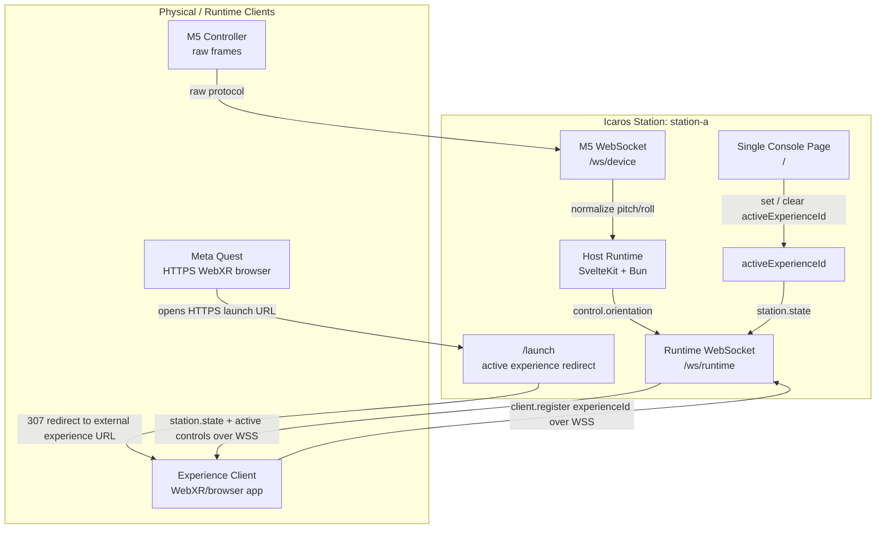

# Icaros Host Architecture

Purpose: this document shows the current one-page MVP architecture. Operational
LAN, HTTPS, and Quest launch setup lives in
[Quest HTTPS Launch Routing](quest-https-launch-routing.md).

## System Diagram

## Data Flow

1. The operator opens the console page `/`.
2. The operator sets an active experience id.
3. The host stores that id as `activeExperienceId`.
4. The Meta Quest opens `/launch` and is redirected to the active WebXR
   experience over HTTPS.
5. The M5 connects over `/ws/device` and sends raw frames.
6. The host validates and normalizes raw frames.
7. Runtime clients connect over `/ws/runtime` using WSS when loaded from HTTPS
   and register their role/id.
8. Runtime clients receive station state.
9. Only the active registered experience receives normalized controls.

## Boundary Rules

- The UI has no subpages in this MVP.
- The host owns routing state, device state, and control translation.
- Quest-facing browser surfaces must support HTTPS, which implies WSS for
  `/ws/runtime`.
- The M5 endpoint owns raw-frame compatibility.
- Experiences receive normalized controls only.
- Static experience serving is not part of the current one-page UI slice.
- `/launch` redirects only; it does not serve or start experience assets.

## Runtime Ownership

| Area | Owner | Boundary |
| --- | --- | --- |
| Station state | Host | Stores `activeExperienceId` and broadcasts station state. |
| Device input | Host | Accepts raw M5 frames only on `/ws/device`. |
| Runtime client API | Host | Accepts registered browser/WebXR clients on `/ws/runtime`. |
| Experience rendering | Experience client | Runs on its own origin, commonly port `5174`. |
| Quest entrypoint | Host `/launch` | Redirects to an already running experience client. |

## LAN Address Resolution

Host-facing URLs must work both for the local operator and for the Quest on the
same network. When server-side routing code sees a loopback hostname
(`localhost`, `127.0.0.1`, or `::1`), it resolves a LAN-safe hostname from the
first non-internal IPv4 address. This lets the console display URLs the Quest can
open directly.

Non-loopback hostnames are preserved. If the operator opens
`https://192.168.50.194:5183/`, generated host and launch URLs keep
`192.168.50.194`.

## Protocol Inheritance

The launch resolver inherits the incoming host protocol unless environment
variables override it:

- `http://<host>:5183/launch` redirects to `http://<host>:5174/` by default.
- `https://<host>:5183/launch` redirects to `https://<host>:5174/` by default.

Browser pages loaded from HTTPS must use WSS for `/ws/runtime`. The public
experience client derives that automatically from `window.location.protocol`.

See [Quest HTTPS Launch Routing](quest-https-launch-routing.md) for exact URL
resolution, environment variables, and troubleshooting.
