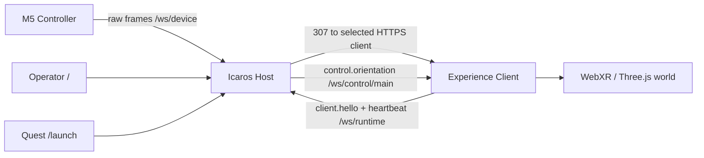

# Icaros Host Architecture

Purpose: describe the stable Host boundaries. Operational Quest, HTTPS, and
certificate steps live in [Quest HTTPS Launch Routing](quest-https-launch-routing.md).

## Core Model

Icaros Host is the station router, gateway, and translator. It is not the VR
experience.

## Invariants

- `/` is the only operator UI page.
- `/launch` redirects to the selected online runtime client's HTTPS URL.
- The Host never serves, starts, or streams experience builds.
- Runtime clients register over `/ws/runtime` only when they should appear in
  launch selection.
- Experiences receive only normalized controls from `/ws/control/main`.
- The M5 sends raw frames only to `/ws/device`.
- Plain `ws://` belongs to the M5 device boundary; browser/WebXR surfaces use
  HTTPS/WSS.
- `/api/m5-pairing` is a diagnostics adapter for CLI and automation, not an
  experience API.

## Runtime Ownership

| Area | Owner |
| --- | --- |
| Station state | Host stores `selectedLaunchClientId` and derived `selectedExperienceId`. |
| Launch selection | Operator console selects one concrete online runtime client. |
| Launch routing | `/launch` resolves the current selected client at request time. |
| Device input | Host accepts paired M5 raw frames and normalizes them. |
| Public controls | Host publishes `control.orientation` on `/ws/control/main`. |
| Experience rendering | External client renders its own WebXR scene. |
| M5 diagnosis | Console and CLI call the same Host-owned pairing core. |

## Safety Boundary

The Host neutralizes missing, stale, invalid, or unsafe controller input before
publishing controls. Experience code should treat `quality: 0` as neutral and
must not parse raw M5 data.
