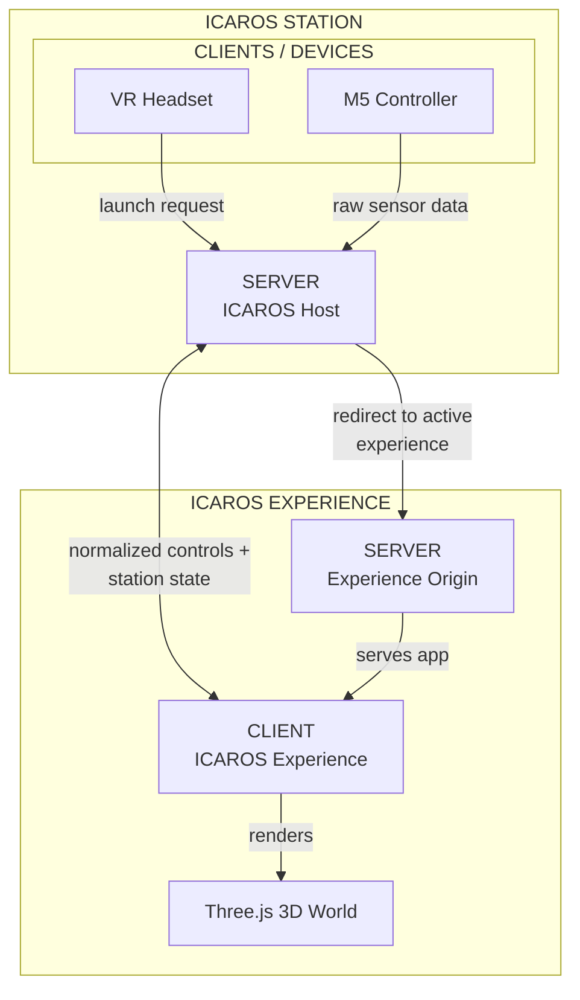
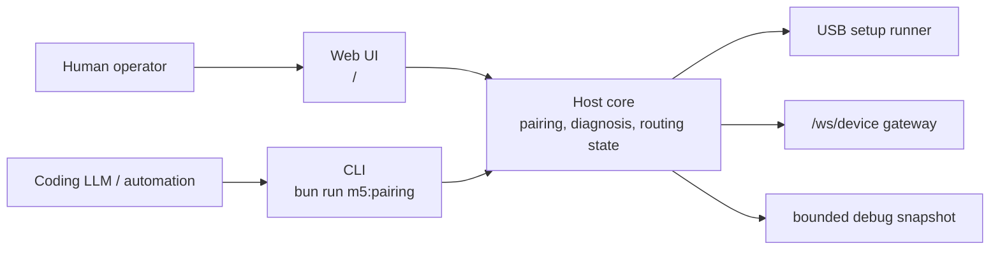

# Icaros Host Architecture

Purpose: this document shows the current one-page MVP architecture. Operational
LAN, HTTPS, and Quest launch setup lives in
[Quest HTTPS Launch Routing](quest-https-launch-routing.md).

## System Diagram

## Data Flow

1. The operator opens the console page `/`.
2. The operator sets an active experience id.
3. The host stores that id as `activeExperienceId`.
4. The Meta Quest opens `/launch` and is redirected to the active WebXR
   experience over HTTPS.
5. The paired M5 connects over `/ws/device?pairing=<token>` and sends raw frames.
6. The host validates and normalizes raw frames.
7. Runtime clients connect over `/ws/runtime` using WSS when loaded from HTTPS
   and register their role/id.
8. Runtime clients receive station state.
9. Only the active registered experience receives normalized controls.

## Boundary Rules

- The UI has no subpages in this MVP.
- The host owns routing state, device state, and control translation.
- Quest-facing browser surfaces must support HTTPS, which implies WSS for
  `/ws/runtime`.
- The M5 endpoint owns raw-frame compatibility and rejects unpaired device
  sockets.
- Experiences receive normalized controls only.
- Static experience serving is not part of the current one-page UI slice.
- `/launch` redirects only; it does not serve or start experience assets.

## Operator Surfaces And Host Core

The target structure separates who operates the station from who owns station
logic:

The web UI is for humans. It should stay dense, visible, and station-oriented:
show the current M5 pairing state, let an operator start USB setup, toggle
debug mode, copy connection URLs, and set the active experience id.

The CLI is for Coding LLMs and automation. It should expose repeatable commands
for environment inspection, redacted pairing URL lookup, health checks,
WebSocket protocol checks, pairing start, and bounded snapshot inspection.

Both surfaces must use the same Host core for M5 pairing and diagnosis. The Host
core owns pairing tokens, status transitions, USB setup execution, debug event
collection, paired `/ws/device` observations, and neutral safe-mode behavior.
When behavior changes, change that core boundary and keep both surfaces thin.

Do not put a second M5 pairing implementation into the CLI. The CLI must not
generate its own authoritative token, run an independent pairing state machine,
parse M5 frames as a parallel source of truth, or depend on modifying the M5
adapter repository. It may trigger Host actions and read Host-owned artifacts.

## Runtime Ownership

| Area | Owner | Boundary |
| --- | --- | --- |
| Station state | Host | Stores `activeExperienceId` and `activeClientId`, then broadcasts station state. |
| Device input | Host | Accepts raw M5 frames only on the paired `/ws/device` URL. |
| M5 pairing and diagnosis | Host core | Owns USB setup state, pairing tokens, bounded debug snapshots, and device socket observations. |
| Human operation | Web UI `/` | Starts pairing and shows current state for station operators. |
| Automation operation | CLI | Calls Host actions and reads Host-owned diagnostics for repeatable checks. |
| Runtime client API | Host | Accepts browser/WebXR clients on `/ws/runtime` through `client.hello`, heartbeat, and concrete client selection. |
| Experience rendering | Experience client | Runs on its own origin, commonly port `5174`. |
| Quest entrypoint | Host `/launch` | Redirects to an already running experience client. |

## LAN Address Resolution

Host-facing URLs must work both for the local operator and for the Quest on the
same network. When server-side routing code sees a loopback hostname
(`localhost`, `127.0.0.1`, or `::1`), it resolves a LAN-safe hostname from the
first non-internal IPv4 address. This lets the console display URLs the Quest can
open directly.

Non-loopback hostnames are preserved. If the operator opens
`https://192.168.50.194:5183/`, generated host and launch URLs keep
`192.168.50.194`.

## HTTPS Launch Target Policy

The launch resolver never falls back to HTTP. Quest-facing launch redirects
require an HTTPS experience target. `bun start` configures the same-machine
HTTPS target automatically. The preferred two-machine form is
`ICAROS_EXPERIENCE_ORIGIN=https://<client-lan-ip-or-name>:5174`:

- Direct server entrypoints without `ICAROS_EXPERIENCE_ORIGIN=https://...` or
  `ICAROS_EXPERIENCE_PROTOCOL=https` return `500` from `/launch` with a
  configuration message.
- `ICAROS_EXPERIENCE_ORIGIN=http://...` and
  `ICAROS_EXPERIENCE_PROTOCOL=http` are rejected.
- With `ICAROS_EXPERIENCE_PROTOCOL=https`, `/launch` targets
  `https://<host>:5174/` unless `ICAROS_EXPERIENCE_PORT` changes the port. Treat
  that as a same-machine convenience; do not use it when Host and Client run on
  different machines.

Browser pages loaded from HTTPS must use WSS for `/ws/runtime`. The public
experience client derives that automatically from `window.location.protocol`.

The current M5 firmware supports plain `ws://` only. The paired device URL is
therefore generated as `ws://.../ws/device?pairing=...` by default, even when
the operator console itself is opened over HTTPS. In HTTPS mode, the host starts
a separate plain device WebSocket listener on port `5184` by default so the M5
does not speak plain WS to the TLS UI/runtime port. If the device WebSocket runs
on a different origin or port, set `ICAROS_DEVICE_WS_ORIGIN` or
`ICAROS_DEVICE_WS_PORT` before starting the host.

See [Quest HTTPS Launch Routing](quest-https-launch-routing.md) for exact URL
resolution, environment variables, and troubleshooting.
