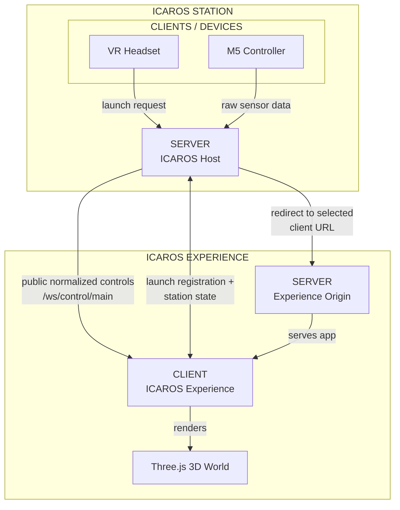
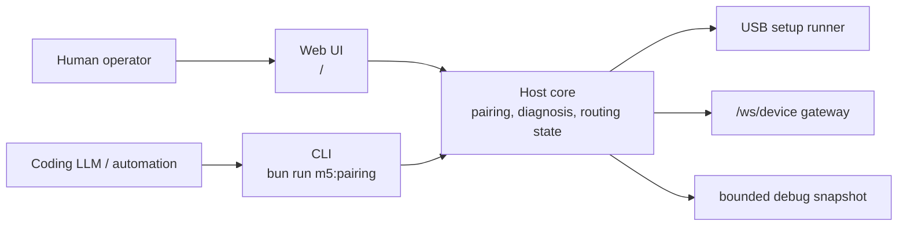

# Icaros Host Architecture

Purpose: this document shows the current one-page MVP architecture. Operational
LAN, HTTPS, and Quest launch setup lives in
[Quest HTTPS Launch Routing](quest-https-launch-routing.md).

## System Diagram

## Data Flow

1. The operator opens the console page `/`.
2. Experience clients subscribe to the public `/ws/control/main` stream.
3. Runtime clients optionally connect over `/ws/runtime` and register with
   `client.hello` for launch selection.
4. The operator selects one concrete online launch client.
5. The Host stores that client's `selectedLaunchClientId` and derives
   `selectedExperienceId` compatibility state from it.
6. The Meta Quest opens `/launch` and is redirected to the selected client's
   registered HTTPS URL.
7. The paired M5 connects over `/ws/device?pairing=<token>` and sends raw
   frames.
8. The Host validates, normalizes, and safe-modes raw frames.
9. Control stream subscribers receive normalized controls.
10. Runtime clients receive station state and runtime client presence.

## Boundary Rules

- The UI has no subpages in this MVP.
- The host owns routing state, device state, and control translation.
- Quest-facing browser surfaces must support HTTPS, which implies WSS for
  `/ws/runtime`.
- The M5 endpoint owns raw-frame compatibility and rejects unpaired device
  sockets.
- Experiences receive normalized controls only through public control streams.
- Static experience serving is not part of the current one-page UI slice.
- `/launch` redirects only; it does not serve or start experience assets.
- `/api/m5-pairing` is diagnostics-only for CLI and automation, not a public UI
  helper API and not an experience API.

## Operator Surfaces And Host Core

The target structure separates who operates the station from who owns station
logic:

The web UI is for humans. It should stay dense, visible, and station-oriented:
show the current M5 pairing state, let an operator start USB setup, toggle
debug mode, copy connection URLs, and select the Launch Client used by
`/launch`.

The CLI is for Coding LLMs and automation. It should expose repeatable commands
for environment inspection, redacted pairing URL lookup, health checks,
WebSocket protocol checks, pairing start, and bounded snapshot inspection.
It reaches the Host through `/api/m5-pairing`, which is a diagnostic adapter
over the same Host core rather than a separate UI helper API.

Both surfaces must use the same Host core for M5 pairing and diagnosis. The Host
core owns pairing tokens, status transitions, USB setup execution, debug event
collection, paired `/ws/device` observations, and neutral safe-mode behavior.
When behavior changes, change that core boundary and keep both surfaces thin.

Do not put a second M5 pairing implementation into the CLI. The CLI must not
generate its own authoritative token, run an independent pairing state machine,
parse M5 frames as a parallel source of truth, or depend on modifying the M5
adapter repository. It may trigger Host actions and read Host-owned artifacts.

## Runtime Ownership

| Area | Owner | Boundary |
| --- | --- | --- |
| Station state | Host | Stores `selectedLaunchClientId` plus derived `selectedExperienceId`, then broadcasts station state. |
| Device input | Host | Accepts raw M5 frames only on the paired `/ws/device` URL. |
| M5 pairing and diagnosis | Host core | Owns USB setup state, pairing tokens, bounded debug snapshots, and device socket observations. |
| Human operation | Web UI `/` | Starts pairing and shows current state for station operators. |
| Automation operation | CLI | Calls Host actions and reads Host-owned diagnostics for repeatable checks. |
| Control stream API | Host | Publishes normalized controls on `/ws/control/main` for subscribed experience clients. |
| Runtime client API | Host | Accepts browser/WebXR launch candidates on `/ws/runtime` through `client.hello`, heartbeat, and concrete launch selection. |
| Experience rendering | Experience client | Runs on its own origin, commonly port `5174`. |
| Quest entrypoint | Host `/launch` | Redirects to the selected online runtime client's registered HTTPS URL. |

## Launch And HTTPS Details

This architecture keeps one rule and one detailed setup document:

- Quest/browser surfaces use HTTPS and WSS.
- `/launch` never redirects to HTTP.
- Plain `ws://` is reserved for the M5 device boundary.
- The Host and standalone VR client use separate certificate files.

See [Quest HTTPS Launch Routing](quest-https-launch-routing.md) for exact LAN
URLs, certificate setup, environment variables, launch behavior, and
troubleshooting.
