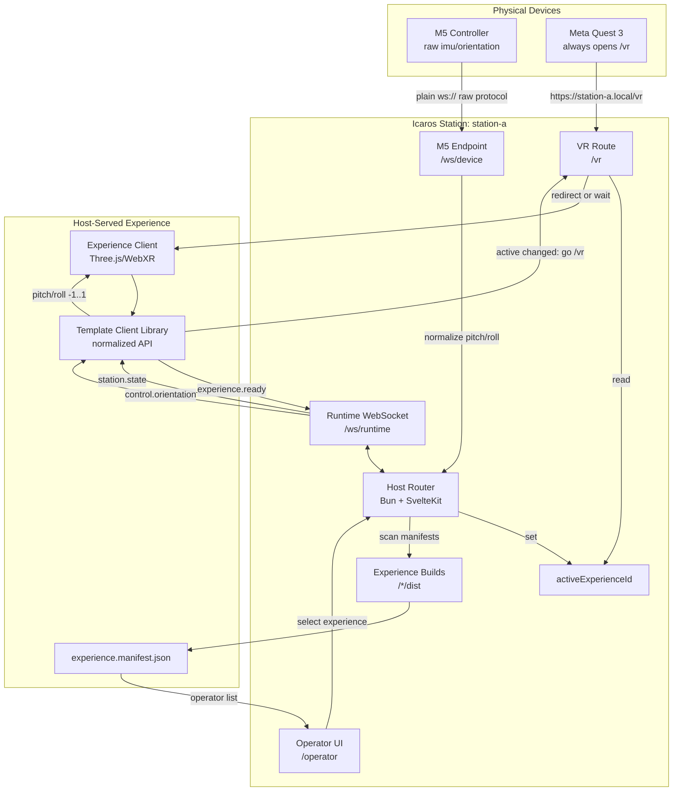

# Icaros Host Architecture

Purpose: this document shows the M1 architecture as a Mermaid diagram and a
short explanation of the data flow. It is the quick visual reference for new
contributors and coding agents.

## System Diagram

## Data Flow

1. The M5 connects to the host over plain WebSocket and sends raw frames.
2. The host validates and normalizes M5 orientation into ICAROS control data.
3. The operator opens `/operator` and selects one installed experience.
4. The host stores that selection as `activeExperienceId`.
5. The Quest always opens `/vr`.
6. `/vr` redirects to `/experiences/<activeExperienceId>/` or waits if none is
   active.
7. The active experience receives only normalized `control.orientation` frames.
8. When `activeExperienceId` changes, the template client returns to `/vr`.

## Boundary Rules

- The host owns routing, device state, station state, and control translation.
- `/vr` owns only redirect and waiting behavior, not game logic.
- The experience owns rendering and WebXR scene logic.
- The template client library owns WebSocket details for student projects.
- The M5 endpoint owns compatibility with the existing firmware protocol.
