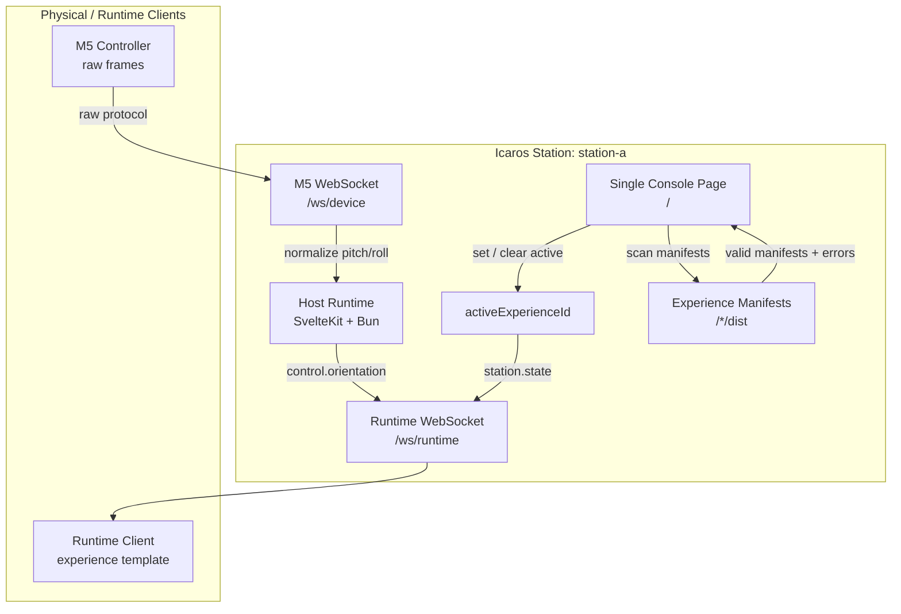

# Icaros Host Architecture

Purpose: this document shows the current one-page MVP architecture.

## System Diagram

## Data Flow

1. The console page `/` scans finished experience manifests.
2. The operator selects one valid experience id.
3. The host stores that id as `activeExperienceId`.
4. The M5 connects over `/ws/device` and sends raw frames.
5. The host validates and normalizes raw frames.
6. Runtime clients connect over `/ws/runtime`.
7. Runtime clients receive station state.
8. Only the active registered experience receives normalized controls.

## Boundary Rules

- The UI has no subpages in this MVP.
- The host owns routing state, device state, and control translation.
- The M5 endpoint owns raw-frame compatibility.
- Experiences receive normalized controls only.
- Static experience serving is not part of the current one-page UI slice.
